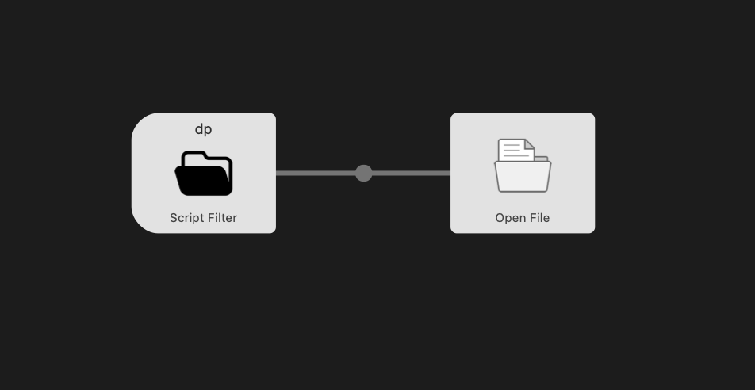

# alfred-workflow_directory-portal
Alfred(Mac App) Workflow - Directory Portal Using Javascript

## Description

> all files in this project only for code maintenance.

main.js -> code for Script Filter

## How to Use

**Prerequisite.** Alfed app is required

1. Download release
2. unpack file
3. Double click the file

## How to Edit and Export

1. import Workflow to Alfred
2. Edit Workflow
3. Export Workflow using Alfred submenu

## Images
1. Folder: [Directory icons created by Andrejs Kirma - Flaticon](https://www.flaticon.com/free-icons/directory)

## Workflow Screenshot

